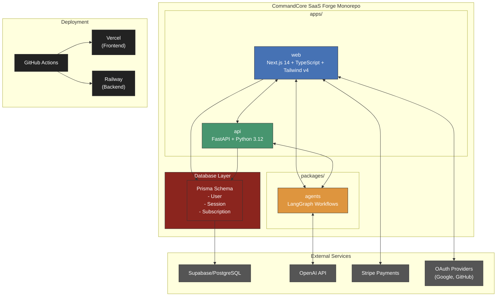

# CommandCore SaaS Forge - Architecture

This document provides a detailed overview of the CommandCore SaaS Forge architecture, illustrating how the different components interact to create a cohesive system for building and deploying SaaS products.

## System Architecture

The CommandCore SaaS Forge is built as a monorepo using pnpm workspaces, with a clear separation of concerns between frontend, backend, and shared packages.

## Component Interactions

### Frontend (Next.js)

The Next.js application serves as the user interface for the CommandCore SaaS Forge. It communicates with:

- **Backend API**: For business logic and data operations
- **Agents Package**: For direct access to AI agent workflows
- **Prisma**: For type-safe database access
- **External Services**: For authentication, payments, etc.

### Backend (FastAPI)

The FastAPI backend provides RESTful API endpoints for:

- **Data Operations**: CRUD operations for application data
- **Business Logic**: Core application functionality
- **Agent Orchestration**: Managing AI agent workflows
- **External Service Integration**: Connecting to third-party services

### Agents Package

The shared agents package contains LangGraph workflows for:

- **Idea Generation**: Discovering and validating SaaS ideas
- **Product Generation**: Creating product specifications and code
- **Deployment**: Automating deployment processes
- **Marketing**: Generating marketing content and strategies

### Database Layer

The Prisma schema defines the data models for:

- **Users**: Authentication and profile information
- **Sessions**: User session management
- **Subscriptions**: Payment and subscription tracking

## Data Flow

1. **User Interaction**: Users interact with the Next.js frontend
2. **API Requests**: Frontend makes requests to the FastAPI backend
3. **Agent Execution**: Backend triggers LangGraph agent workflows
4. **Database Operations**: Data is persisted to Supabase/PostgreSQL
5. **External Service Integration**: System integrates with third-party services

## Deployment Pipeline

The CI/CD pipeline is managed through GitHub Actions:

1. **Code Push**: Developer pushes code to GitHub
2. **CI Workflow**: GitHub Actions runs linting, testing, and building
3. **Deployment**: On successful CI, code is deployed to:
   - Frontend: Vercel
   - Backend: Railway
4. **Database Migrations**: Prisma migrations are applied to the database

## Security Considerations

- **Authentication**: NextAuth.js with multiple providers
- **Authorization**: Role-based access control
- **Data Protection**: Encrypted environment variables
- **API Security**: Rate limiting, CORS protection, and input validation

## Scalability

The architecture is designed to scale horizontally:

- **Stateless Services**: Both frontend and backend can be scaled independently
- **Database Scaling**: Supabase/PostgreSQL can be scaled as needed
- **Serverless Functions**: For handling variable workloads
